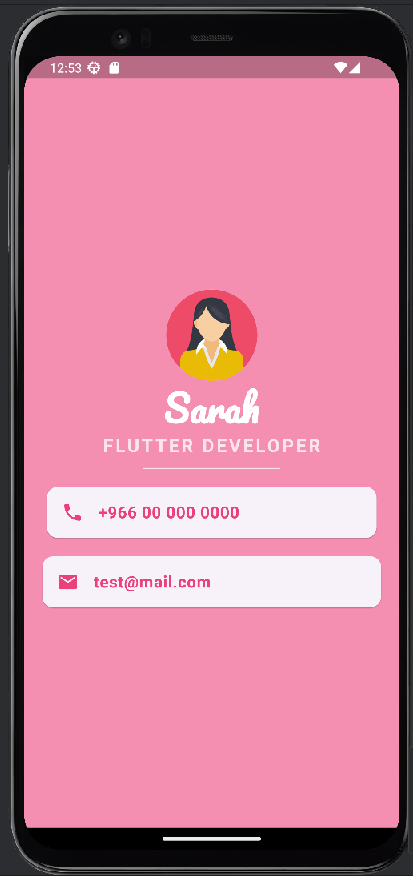

# Mi Card - Personal Business Card App

MiCard is a Flutter-based personal business card application that allows you to share your contact information in a digital format, ensuring you always have your business card with you, in the form of a mobile app!
## Preview

This project was created as part of **The Complete Flutter Development Bootcamp with Dart** on Udemy, and it helped me learn fundamental Flutter concepts like user interface design, widget creation, and styling.

## Table of Contents
- [Our Goal](#our-goal)
- [What I Create](#what-i-create)
- [What I Learn](#what-i-learn)
- [Features](#features)
- [Technologies Used](#technologies-used)

## Our Goal
This project aims to teach the process of building a Flutter app from scratch and takes a deeper dive into designing user interfaces for mobile apps using Flutter's widget system. This is a great stepping stone for anyone looking to develop their skills in cross-platform mobile app development.

## What I Create
Mi Card is essentially a digital business card. Imagine needing to share your contact information but not having a physical business card on hand. With Mi Card, you can share your details through an app that anyone can download!

## What I Learn
By building the Mi Card app, you will learn how to:

- Create **Stateless Widgets** and understand their role in Flutter's widget hierarchy.
- Differentiate between **hot reload**, **hot refresh**, and **cold start** when running your Flutter app.
- Use **Containers** to build the structure of your app’s UI.
- Arrange elements using **Columns** and **Rows** to create responsive designs.
- Incorporate **custom fonts** to personalize the look and feel of your app.
- Add and use **Material icons** to enhance your UI.
- Style **Text widgets** to create aesthetically pleasing text displays.
- Navigate and use the **Flutter Documentation** to find helpful resources and examples.

## Features
- Display of personal information such as name, job title, and contact details.
- Clean and modern UI, optimized for both iOS and Android devices.
- Custom fonts, Material icons, and responsive layout.

## Technologies Used
- **Flutter**: UI toolkit for building natively compiled mobile apps.
- **Dart**: Programming language used in Flutter.
- **Android Studio**: IDE used for development.

